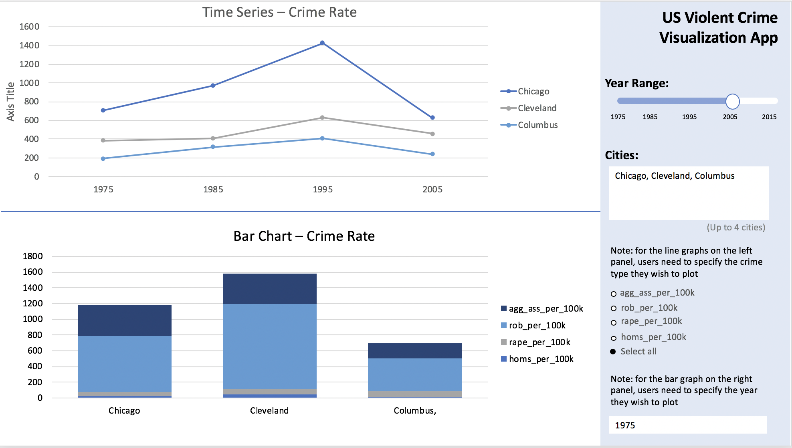

DSCI 532 Project Proposal
================

Overview
--------

Recent decades have seen violent crime in the U.S. decrease nationwide, but not all jurisdictions have experienced this decrease. In fact, there is considerable heterogeneity in violent crime rates among American cities, and violent crime continues to be major problem for many of them. For this reason, it is useful to look at more granular data about violent crime. To do so, we propose building a visualization app that will allow users to compare the violent crime rates and patterns in violent crime between multiple cities. Our app will allow users to specify a time period, a set of cities, and a type of crime to compare. Users will be able to see the long term trends in crime rates for the cities they specify, as well as look at the composition of violent crime for a specific year across those cities.

Data Description
----------------

Our dataset comes from the Marhsall Project, which compiled crime data for major American cities from the FBI's Uniform Crime Reporting (UCR) Program. The dataset covers the period from 1975 - 2015, and contains information on sixty-eight cities, as well as national averages. For this project, we will be looking only at crime rates that are normalized by population (i.e. crime per 100,000 people). For each city, we have five annual crime rates: total violent crime rate and crime rates for four specific types of violent crime (assault, homicide, rape, and robbery).

#### Key Variables

<table style="width:40%;">
<colgroup>
<col width="13%" />
<col width="18%" />
<col width="8%" />
</colgroup>
<thead>
<tr class="header">
<th>Variable Name</th>
<th>Description</th>
<th>Type</th>
</tr>
</thead>
<tbody>
<tr class="odd">
<td><code>department_name</code></td>
<td>US city name</td>
<td>Categorical</td>
</tr>
<tr class="even">
<td><code>year</code></td>
<td>Year from 1975-2015</td>
<td>Numerical</td>
</tr>
<tr class="odd">
<td><code>violent_per_100k</code></td>
<td>Normalized violent crime rate (i.e. number of violent crimes per 100k people)</td>
<td>Numerical</td>
</tr>
<tr class="even">
<td><code>homs_per_100k</code></td>
<td>Normalized homicide rate (i.e. number of homicides per 100k people)</td>
<td>Numerical</td>
</tr>
<tr class="odd">
<td><code>rape_per_100k</code></td>
<td>Normalized rape rate (i.e. number of rapes per 100k people)</td>
<td>Numerical</td>
</tr>
<tr class="even">
<td><code>rob_per_100k</code></td>
<td>Normalized robbery rate (i.e. number of robberies per 100k people)</td>
<td>Numerical</td>
</tr>
<tr class="odd">
<td><code>agg_ass_per_100k</code></td>
<td>Normalized aggravated assault rate (i.e. number of aggravated assaults per 100k people)</td>
<td>Numerical</td>
</tr>
</tbody>
</table>

Usage Scenario and Tasks
------------------------

A crime analyst reads an article claiming that violent crime in the Midwest has been falling in the past 25 years. To get a richer understanding of crime in the Midwest, she decides to use our app to compare the total violent crime rates accross a set of large Midwestern cities: Cincinnati, OH; Chicago, IL; St. Louis, MO; Milwaukee, WI; and Minneapolis, MN. To do this she selects the cities, a range of years, and the variable total violent crime rate in the side bar panel of our app. Looking at a time series plot, she notices that there were large decreases in violent crime in Chicago throughout the 1990s, while crime rates in other Midwestern cities stayed fairly constant over the same period. She suspects that falling violent crime in the Midwest may be largely the result of successful violence reduction programs in Chicago, and decides to investigate further. Perhaps there were policies implemented in Chicago that could be successful elsewhere for reducing violent crime.

Description of App and Sketch
-----------------------------

Our app's landing page will have two panels. The first panel will have a time series plot that can be used to look at trends in crime rates for up to six cities. Users interact with our app through a side bar panel. In the side bar, useres will be able to select the cities using a dropdown menu, the type of crime they are interested in using radio buttons, and the range of dates using a slider.

The second panel will be a bar plot for comparing the proportion of total violent crime the selected type of crime comprised in one year for different cities. The cities represented here will be the same as the cities selected for the first panel. Users will be able to select which year they want to view from a dropdown menu. The choice of year will be limited to the range specified for panel one. If total violent crime is selected instead of a specific type of crime, then the bar plot will show the composition of violent crime.

#### App Sketch

